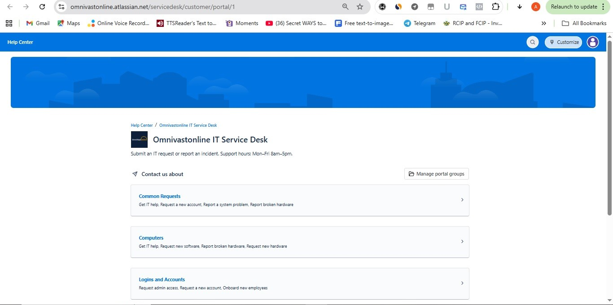
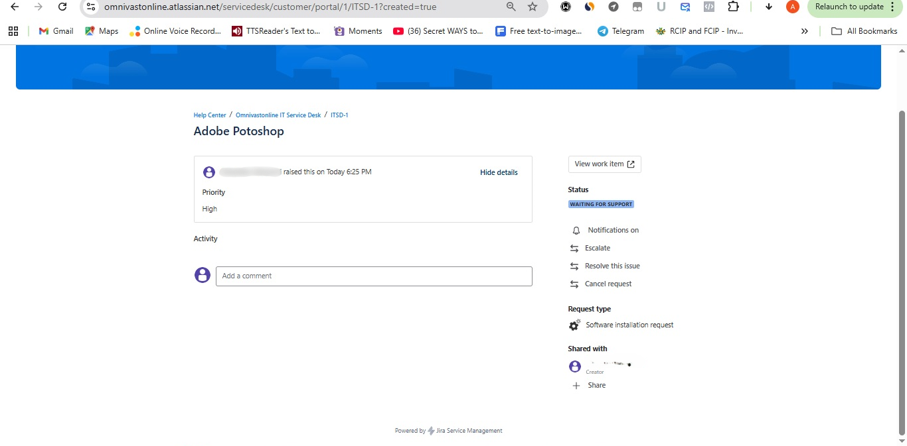
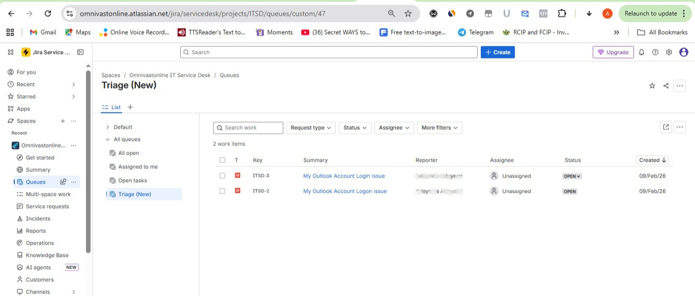

# Jira Service Management – IT Service Desk (Portfolio Lab)

## Overview
Configured a Jira Service Management (JSM) IT Service Desk for a fictional company (**Omnivastonline**) and simulated ticket handling using an ITSM-style workflow:
**Open → In Progress → Waiting for customer → Resolved**.

> Portfolio simulation (not a production environment).

## Tools Used
- Jira Service Management (Cloud)
- Help Center (Customer Portal)
- Request types + portal groups
- Queues (triage and assignment)

## What I Configured
- Help Center portal structure (portal groups/categories)
- Request types for common IT requests/incidents
- Queues:
  - **Triage (New)**: unassigned incoming requests
  - **Assigned to me**: tickets assigned to the agent
- Ticket lifecycle handling (assignment, status updates, resolution)

## Screenshots (Evidence)

### Portal / Request Types

### Queues

